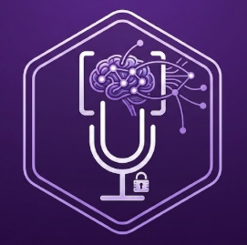
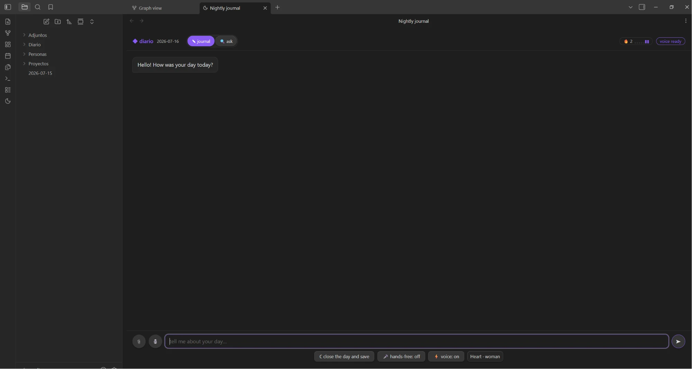

<p align="center">
  
</p>

# Nightly Journal

**A local AI interviews you at the end of your day and writes your journal for you — 100% local via [Ollama](https://ollama.com).**

**Una IA local te entrevista al final del día y escribe tu diario por ti — 100% local con [Ollama](https://ollama.com).**



[English](#english) · [Español](#español)

---

## English

### What it does

Chat for two minutes at the end of your day. The plugin interviews you with short, warm follow-up questions; when you close the day it shows a **writing plan** — item by item, with checkboxes — and only after you confirm does it write to your vault: a daily note with mood and energy, plus person and project notes connected with wikilinks.

No cloud, no accounts, no telemetry: the model runs on your machine.

### Features

- **Nightly interview** — type, dictate with the mic 🎙️, or go hands-free 🎤: it detects when you pause, sends automatically, and replies out loud.
- **A plan you confirm** — untick anything you don't want saved; nothing is written without your OK.
- **Structured notes** — daily note (mood/energy frontmatter, summary, wins, to-dos), `People/Mari.md`, `Projects/…` — the wikilinks build your graph night after night.
- **Long-term memory** — with a local embeddings model it remembers your old notes and connects them: *"is this the tooth you said they were going to pull?"*.
- **Ask your journal** — in the 🔍 tab, ask about your own past. It answers **only from your notes, citing the date**, with clickable sources that open the note. When it doesn't know, it says so honestly.
- **Attachments become memory** — attach photos, PDFs or text files 📎: PDF text is extracted and images are described by the local model, so you can ask about them later.
- **Voice, fully local (optional)** — text-to-speech (Kokoro) and speech-to-text (Whisper) through a small local sidecar. Without it, the plugin works in text-only mode.
- **Streak & energy** — 🔥 consecutive nights and a 7-day energy sparkline in the header.
- **Undo (optional)** — with git auto-commit enabled, each session is one commit and the undo button reverts it.
- **English or Spanish** — follows your Obsidian language by default; switchable in settings.

### Requirements

- Obsidian **desktop** (the plugin talks to a local model; mobile is not supported).
- [Ollama](https://ollama.com/download) running locally, with the interview model:

```
ollama pull gemma3:4b
```

Optional, recommended:

| Model | Enables |
| --- | --- |
| `ollama pull embeddinggemma` | long-term memory + the *ask your journal* tab |
| `ollama pull gemma3:12b` | higher-quality extraction (set as *extraction model* in settings) |

If Ollama or a model is missing, the plugin shows a friendly first-run card with instructions — not an error.

### How to use

1. Click the 🌙 moon icon in the ribbon (or run the command *"Open nightly journal"*).
2. Tell it about your day. Attach photos or documents with 📎 if you like.
3. Press *"☾ close the day and save"* (or just say "nothing else").
4. Review the writing plan, untick what you don't want, confirm.
5. Any time, switch to the **🔍 ask** tab and ask your memory: *"when did I last see Mari?"*

### Settings

- **Ollama URL** and the three models (interview / extraction / memory).
- **Guided questions per session** — how many questions before it starts wrapping up.
- **Language** — *Automatic (Obsidian language)*, English or Spanish. The folder schema of a vault that already has entries never changes, so your vault won't fragment.
- **Git auto-commit** — **off by default**. Turning it on creates a git repository *inside your vault* and commits once per session, which enables the undo button. Keep it off if your vault is already in git or you use another git plugin.
- **Voice** — sidecar URL, and (advanced) paths so the plugin can auto-start the sidecar.

### Voice sidecar (optional)

Voice uses a local FastAPI sidecar with Kokoro (TTS) and Whisper (STT), included in this repository at `apps/voz/servidor_voz.py`:

```
python -m venv .venv
.venv/Scripts/pip install fastapi uvicorn kokoro faster-whisper pymupdf soundfile num2words
.venv/Scripts/python apps/voz/servidor_voz.py 8765
```

Then set the sidecar URL in settings (`http://127.0.0.1:8765`). If you also fill in the *advanced* paths (python, script, working directory), the plugin starts the sidecar by itself when it's not running.

### Privacy

Everything stays on your machine: the interview (Ollama on localhost), the memory index (`.indice/rag.json`, inside your vault and invisible to Obsidian), voice, and PDF extraction (`127.0.0.1`). The plugin makes no network requests beyond localhost.

### Build from source

```
npm install --prefix apps/diario
npm install --prefix apps/obsidian
npm run build --prefix apps/obsidian    # typecheck + bundle → apps/obsidian/main.js
```

---

## Español

### Qué hace

Charla dos minutos al final de tu día. El plugin te entrevista con preguntas cortas y cálidas; al cerrar el día te muestra un **plan de escritura** — ítem por ítem, con casillas — y solo cuando confirmas escribe en tu vault: la nota diaria con ánimo y energía, más notas de personas y proyectos conectadas con wikilinks.

Sin nube, sin cuentas, sin telemetría: el modelo corre en tu máquina.

### Funciones

- **Entrevista nocturna** — escribe, dicta con el mic 🎙️, o manos libres 🎤: detecta tus pausas, envía solo y te responde hablando.
- **Un plan que tú confirmas** — desmarca lo que no quieras guardar; nada se escribe sin tu OK.
- **Notas estructuradas** — nota diaria (frontmatter de ánimo/energía, resumen, logros, pendientes), `Personas/Mari.md`, `Proyectos/…` — los wikilinks arman tu grafo noche a noche.
- **Memoria de largo plazo** — con un modelo de embeddings local recuerda tus notas viejas y las conecta: *"¿es la muela que dijiste que te iban a sacar?"*.
- **Pregúntale a tu diario** — en la pestaña 🔍 pregunta por tu propio pasado. Responde **solo con tus notas, citando la fecha**, con fuentes clicables que abren la nota. Cuando no sabe, lo dice honestamente.
- **Los adjuntos se vuelven memoria** — adjunta fotos, PDF o archivos de texto 📎: el texto de los PDF se extrae y las imágenes las describe el modelo local, para que luego puedas preguntar por ellos.
- **Voz 100% local (opcional)** — texto a voz (Kokoro) y voz a texto (Whisper) con un pequeño sidecar local. Sin él, el plugin funciona en solo texto.
- **Racha y energía** — 🔥 noches seguidas y mini-gráfica de energía de la semana en el encabezado.
- **Deshacer (opcional)** — con git auto-commit activado, cada sesión es un commit y el botón deshacer lo revierte.
- **Español o inglés** — hereda el idioma de Obsidian por defecto; se puede fijar en los ajustes.

### Requisitos

- Obsidian de **escritorio** (el plugin habla con un modelo local; no funciona en móvil).
- [Ollama](https://ollama.com/download) corriendo localmente, con el modelo de entrevista:

```
ollama pull gemma3:4b
```

Opcional, recomendado:

| Modelo | Habilita |
| --- | --- |
| `ollama pull embeddinggemma` | memoria de largo plazo + la pestaña *consultar* |
| `ollama pull gemma3:12b` | extracción de más calidad (ponlo como *modelo de extracción* en los ajustes) |

Si falta Ollama o un modelo, el plugin muestra una tarjeta de primer arranque con instrucciones — no un error.

### Cómo se usa

1. Haz clic en el icono 🌙 de la barra lateral (o el comando *"Abrir diario nocturno"*).
2. Cuéntale tu día. Adjunta fotos o documentos con 📎 si quieres.
3. Pulsa *"☾ cerrar el día y registrar"* (o simplemente di "nada más").
4. Revisa el plan de escritura, desmarca lo que no quieras, confirma.
5. Cuando quieras, cambia a la pestaña **🔍 consultar** y pregúntale a tu memoria: *"¿cuándo fue la última vez que vi a Mari?"*

### Ajustes

- **URL de Ollama** y los tres modelos (entrevista / extracción / memoria).
- **Preguntas guiadas por sesión** — cuántas preguntas antes de empezar el cierre.
- **Idioma** — *Automático (idioma de Obsidian)*, español o inglés. El esquema de carpetas de un vault con entradas no cambia nunca, así tu vault no se fragmenta.
- **Auto-commit con git** — **apagado por defecto**. Al activarlo crea un repositorio git *dentro de tu vault* y hace un commit por sesión, lo que habilita el botón deshacer. Déjalo apagado si tu vault ya está en git o usas otro plugin de git.
- **Voz** — URL del sidecar y (avanzado) rutas para que el plugin lo arranque solo.

### Sidecar de voz (opcional)

La voz usa un sidecar local FastAPI con Kokoro (TTS) y Whisper (STT), incluido en este repositorio en `apps/voz/servidor_voz.py`:

```
python -m venv .venv
.venv/Scripts/pip install fastapi uvicorn kokoro faster-whisper pymupdf soundfile num2words
.venv/Scripts/python apps/voz/servidor_voz.py 8765
```

Luego pon la URL del sidecar en los ajustes (`http://127.0.0.1:8765`). Si además llenas las rutas *avanzadas* (python, script, carpeta de trabajo), el plugin arranca el sidecar solo cuando no está corriendo.

### Privacidad

Todo queda en tu máquina: la entrevista (Ollama en localhost), el índice de memoria (`.indice/rag.json`, dentro de tu vault e invisible para Obsidian), la voz y la extracción de PDF (`127.0.0.1`). El plugin no hace ninguna petición de red fuera de localhost.

### Compilar desde el código

```
npm install --prefix apps/diario
npm install --prefix apps/obsidian
npm run build --prefix apps/obsidian    # typecheck + bundle → apps/obsidian/main.js
```

---

## License · Licencia

[MIT](LICENSE)
